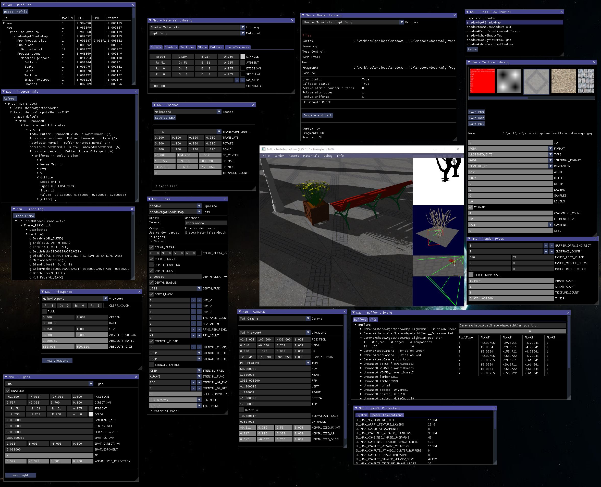

Nau
===

Nau 3D engine: OpenGL + Optix 7 (WIP) + Lua + ImGui 

A carrack (Portuguese: nau, Spanish: nao, Catalan: carraca) was a three- or four-masted ocean-going sailing ship that was developed in the 14th to 15th centuries in Europe, most notably in Spain and Portugal. (from Wikipedia [https://en.wikipedia.org/wiki/Carrack]). The name is due to the spirit of those saylors who sailed into the unknown.

The Portuguese word Nau reads as "now" in English, hinting at the purpose of this repository: to allow the fast creation of 3D content to be rendered in realtime.

Nau is an API to speed up the creation of 3D shader pipelines. It integrates both rasterization and ray tracing in a single package, providing all the tools to create complex multipass graphic pipelines with shaders written in GLSL, and kernels written in CUDA for Optix7. 

Nau3D supports the reading of XML files describing both scenes and graphics pipelines, which can range from simple to highly complex. All the example projects provided are based on XML files, together with shaders and cuda kernels, allowing the creation of a vast range of graphical effects.

Note that Nau3D does not include any prebuilt effects in the lib itself. The lib is built not to provide these effects out of the box, but instead to allow the creation of any desired effect (almost :-) ). 

Currently Nau3D supports vertex, tessellation, geometry, mesh and task shaders, fragment, and compute shaders. It also supports NVIDIA's Optix ray tracer.

The main goal is to focus on the shaders and kernels. All the C++ stuff, including OpenGL and Optix stuff is handled by Nau3D. 

It further supports Lua scrippting to provide an easy way to expand functionality. When scripting is not enough or not efficient, plugins can be written for Nau to complement Nau's pass functionality. Examples are provided in folder plugins.

The accompanying interface application (Composer) has debugging features that help the construction of such pipelines. With Composer the user can explore all the settings relating to the inputs and outputs of the graphics pipeline.

It can be used as a teaching tool for shader and ray tracing courses providing a seamless integration between the two rendering approaches.

Some documentation is available at http://nau3d.di.uminho.pt/

# credits

Besides myself, many people have contributed to this project:

* Bruno Oliveira - software architecture, programming
* Pedro Ângelo - programming
* Marta Pereira - initial implementation of the event system manager
* Leander Beernaert - initial Linux version, initial CMake building system
* André Lui - initial implementation of the debug features 

ImGuiFileDialog from https://github.com/aiekick/ImGuiFileDialog

Nau3D uses the following 3rd party libraries:

* Optix (optional)(https://developer.nvidia.com/optix)
* imGui (https://github.com/ocornut/imgui)
* glBinding for OpenGL bindings and call tracing (https://github.com/cginternals/glbinding)
* Assimp for 3D asset loading (https://www.assimp.org/)
* Devil for image loading (http://openil.sourceforge.net/)
* TimyXML for project and settings loading (https://sourceforge.net/projects/tinyxml)

Interface applications:

* GLFW
* GLUT

All source code or libs is provided in the package (apart from Opix) to prevent disruption when any of those packages is updated.

# CMAKE settings and requirements

To build nau, with GLUT and GLFW (with ImGui) demo, 
the project is self-contained for Windows. For Linux install opengl, and devil
* Devil 
	* sudo apt-get install libdevil-dev
* Freeglut (as a short cut to installing opengl)
	* sudo apt-get install freeglut3-dev
	
Note: IF fail to compile freeglut try
* cd /usr/include/X11/extensions
* sudo ln –s XI.h XInput.h

To build nau with nvidia's optix 7 support (optional) both cuda and optix are required.

* In the cmake project check the option "NAU_BUILD_WITH_OPTIX"
* Set the variable NAU_OPTIX_DIR to optix's installation directory
* CUDA is usually found by cmake and doesn't need any extra steps.
* If either CUDA or Optix are not found the process goes on without Optix support.		

# running

* composerImGUI is an almost complete interface to NAU3D using GLFW and ImGui
* nauGLUT provides a simple example of a GLUT application working with NAU3D
